# Distributed In-Memory NoSQL Database


A high-performance, distributed, and thread-safe Key-Value NoSQL database built entirely in Java from scratch (Zero external dependencies for the core engine).

It features a custom length-prefixed binary TCP protocol, Asynchronous Write-Ahead Logging (WAL) with snapshot compaction, Master-Replica replication, and advanced secondary indexing via Trie and AVL Trees.

## 🚀 Performance Benchmarks
Tested on a standard local machine using a 100-thread concurrent stress test generating 1,000,000 operations.

| Operation | Concurrency | Throughput (ops/sec) | Time (ms) |
| :--- | :--- | :--- | :--- |
| **READ (GET)** | 100 Threads | **~3,496,503 ops/sec** | 286 ms |
| **WRITE (SET)** | 100 Threads | **~436,872 ops/sec** | 2289 ms |

> **Note on Benchmarks:** These metrics represent raw **in-memory throughput** bypassing the TCP stack and disk I/O. The massive multi-core throughput is achieved through Lock Striping (Sharding), allowing completely parallel non-blocking reads and writes across independent memory segments. In a real-world scenario via TCP with WAL enabled, latency will naturally be bound by network constraints and disk IOPS.

## 🧠 Core Features

* **Thread-Safe Core (Lock Striping)**: Memory is dynamically divided into 16 isolated shards, each managing its own concurrency lock and LRU Linked-List. This eliminates global bottlenecks.
* **LRU Eviction & TTL**: Automatic memory management based on capacity and Time-To-Live expiration. The background cleaner thread operates per-shard to prevent system freezes.
* **Asynchronous Write-Ahead Logging (WAL)**: Employs a Producer-Consumer pattern. Disk I/O is offloaded to a background Flusher thread via a `BlockingQueue`, guaranteeing durability (batching) without blocking client network requests.
* **Distributed Replication**: Master/Replica architecture for read scalability, featuring automatic reconnection streams and state synchronization (Snapshotting & Real-Time Broadcast).
* **Advanced Secondary Indexing**:
  * **Prefix Tree (Trie)**: Enables O(K) auto-completion and prefix searches using memory-optimized nodes.
  * **AVL Tree**: Enables O(log N) self-balancing lexicographical range queries.
  * *Safety Check: Both indexes implement Early-Abort Pagination to protect JVM RAM from OutOfMemory errors during massive queries.*
* **Binary TCP Protocol**: Built a robust length-prefixed binary protocol utilizing Java NIO concepts, preventing data corruption when handling complex strings and JSON payloads.

## 📁 Project Structure

```text
noSQLproject/
├── build.xml                   # Apache Ant build configuration file
├── lib/                        # External dependencies (e.g., JUnit JARs)
├── src/
│   ├── main/java/
│   │   ├── network/            # TCP Protocol & Server Node Logic
│   │   └── store/              # Core Database Engine & Data Structures
│   └── test/java/
│       └── store/              # JUnit 5 Test Suite
├── build/                      # Compiled class files (Generated by Ant)
└── dist/                       # Packaged JAR archives (Generated by Ant)
```

## 🏗️ Architecture: The Write Path (SET Command)

```mermaid
sequenceDiagram
    autonumber
    participant Client as TCP Client
    participant Server as DatabaseServer
    participant WAL as WalDecorator
    participant Store as ShardedCacheStore
    participant Shard as CacheShard (Lock Striped)
    participant Disk as master.log (Disk)

    Client->>Server: Send Binary Protocol (SET)
    Server->>WAL: set("key", "value")
    
    rect rgb(40, 44, 52)
    Note over WAL, Shard: In-Memory Execution (Non-Blocking)
    WAL->>Store: innerStore.set("key", "value")
    Store->>Shard: route via hash(key) % 16
    Shard-->>Store: returns (evictedKey if any)
    Store-->>WAL: update indexes (Trie/AVL)
    end
    
    WAL--)WAL: queueWrite("SET", "key", "value")
    WAL-->>Server: return OK
    Server-->>Client: "OK"
    
    rect rgb(40, 44, 52)
    Note over WAL, Disk: Background Asynchronous Disk I/O
    WAL->>Disk: Flusher Thread polls queue & writes to disk
    end
```



## ⚙️ Architectural Decisions & Trade-offs

* **Why Lock Striping over a Global ReadWriteLock?**
  Initially, a global `ReentrantReadWriteLock` was used. However, because updating an LRU cache requires moving nodes to the head of the list, every "read" operation intrinsically became a "write" operation, serializing all access. By sharding the cache into 16 independent segments, threads only contend if their keys hash to the exact same shard.
* **Why Asynchronous WAL?**
  Synchronous `flush()` calls to the disk for every `SET` operation physically bottlenecked the database to the drive's IOPS limit. Decoupling the network processing from the physical disk writing allows the engine to instantly respond to clients while safely batching operations to the disk.
* **Why no Automatic Failover?**
  Implementing a naive automatic Master promotion during a network partition leads to the "Split-Brain" problem. True failover requires a distributed consensus algorithm (like Raft or Paxos). I chose to prioritize strict data consistency over availability in this scope.

## 🛠️ Getting Started

### Prerequisites
* Java Development Kit (JDK) 11 or higher.
* Apache Ant installed.

### 1. Build the Project
Use Apache Ant to clean, compile, test, and package the project. Open your terminal at the root of the project:
```bash
ant clean build
```

### 2. Run the Nodes (Separate Terminals)
Assuming Ant compiles the output to the `build/classes` directory:
```bash
# Start the Master Node (Port 9000, WAL enabled) using the generated JAR
java -jar dist/database-master.jar

# Start the Replica Node (Port 9001, In-Memory only, syncs from Master)
java -cp build/classes network.ReplicaNode
```

### 3. Connect via the Interactive Client
```bash
java -cp build/classes network.DatabaseClient
```

## 🧪 Running the Tests

The project includes a robust suite of Unit and Integration tests covering thread-safety, eviction logic, WAL recovery, and Master-Replica synchronization.

To execute the test suite via Ant:
```bash
ant test
```

Key testing files include:
* `ConcurrencyTest.java`: Bombards the engine with 200+ threads to validate Lock Striping and `ReadWriteLock` integrity.
* `ReplicationIntegrationTest.java`: End-to-end socket testing of the initial Snapshot and real-time command broadcasting.
* `WalPersistenceTest.java`: Simulates power failures and truncated binary writes to ensure data recovery.

## 💻 Supported Commands & Interactive Demo

| Command | Syntax | Description |
| :--- | :--- | :--- |
| **SET** | `SET <key> <value>` | Stores a key-value pair. (Supports JSON/spaces) |
| **SET_EX** | `SET_EX <key> <value> <sec>` | Stores a pair with a Time-To-Live (TTL). |
| **GET** | `GET <key>` | Retrieves the value of a key. |
| **DELETE**| `DELETE <key>` | Removes a key and its indexes. |
| **EXISTS**| `EXISTS <key>` | Returns 1 if the key exists, 0 otherwise. |
| **INCR** | `INCR <key>` | Atomically increments an integer value by 1. |
| **TTL** | `TTL <key>` | Returns the remaining time to live of a key. |
| **FLUSHALL**| `FLUSHALL` | Clears the entire database and indexes. |
| **PREFIX**| `PREFIX <string>` | Returns keys starting with the string (Paginated). |
| **RANGE** | `RANGE <start> <end>` | Returns keys falling in the alphabetical range (Paginated). |

**Example Terminal Session:**
```text
Connected to database!
> SET user:1 {"name": "Alice", "role": "admin"}
OK
> SET user:2 {"name": "Bob", "role": "user"}
OK
> PREFIX user:
user:1, user:2
> SET_EX temp_token 49fb2a 10
OK
> TTL temp_token
(integer) 10
> EXIT
Disconnected.
```

## 🚧 Limitations & Future Improvements

* **Global Locking on Secondary Indexes (AVL / Trie):** While the primary Key-Value store achieves massive concurrency via Lock Striping, the secondary indexes currently rely on a global `ReentrantReadWriteLock`.
* **Data Loss on Replica Micro-Disconnections:** A robust fix requires implementing a Circular Ring Buffer and Transaction Offsets akin to Kafka or Redis replication streams.
* **Memory Spike during Replica Full Sync:** A planned optimization involves implementing a paginated cursor directly at the `CacheShard` level to stream the snapshot in smaller, memory-safe batches.
